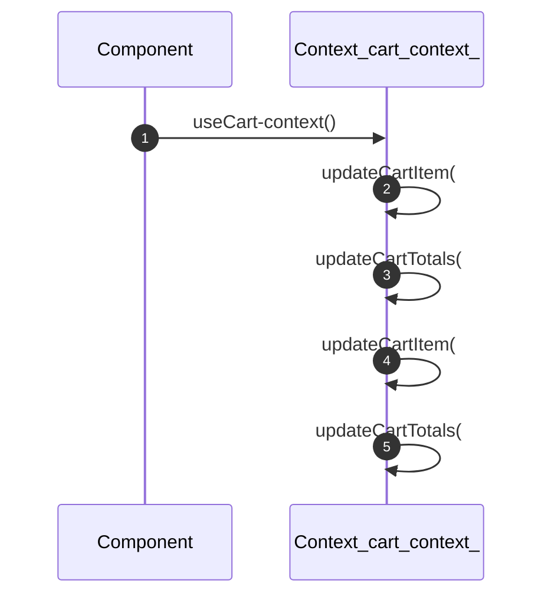
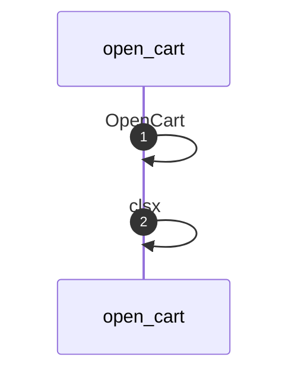
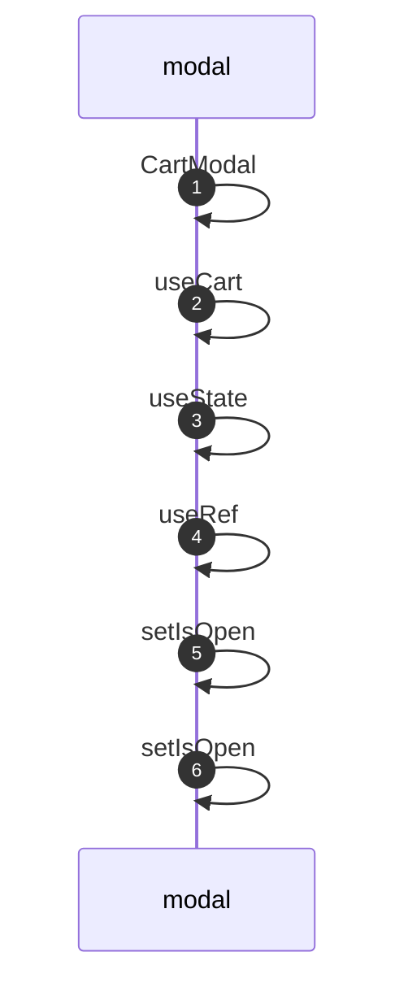
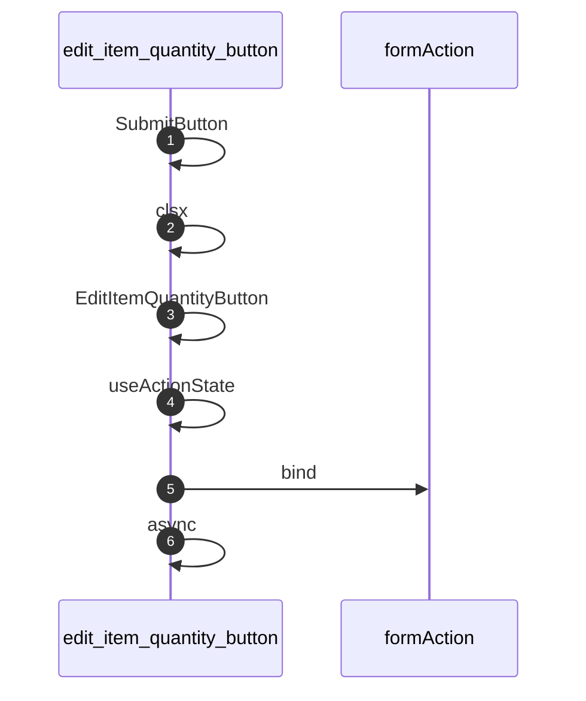
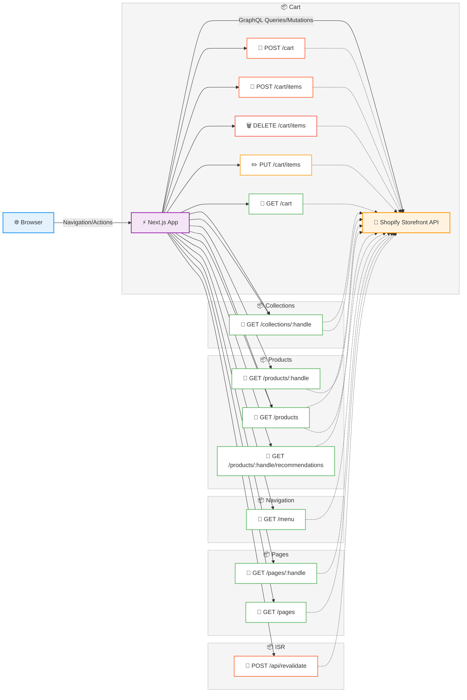

# Code Analysis Report: commerce

| Property | Value |
|----------|-------|
| **Generated** | 2026-04-13T00:49:48.722Z |
| **Project** | C:\\Users\\kktam\\Documents\\code\\next\\commerce |
| **Duration** | 457ms |
| **Tools Used** | architecture, api, metrics, dependencies |

---

## Summary

Analysis complete: 4 tools ran successfully, 0 failed.

---

## Architecture Analysis

**Framework:** Next.js App Router + Tailwind + Headless UI
**Source Files:** 65
**Total Lines:** 3,961

### File Types

| Extension | Count |
|-----------|-------|
| .ts | 20 |
| .tsx | 45 |

### Project Structure

    - **outputs** (1 files)
      - **output** (4 files)
    - **lib** (3 files)
      - **shopify** (2 files)
    - **fonts** (1 files)
    - **output** (5 files)
    - **components** (8 files)
      - **icons** (1 files)
      - **product** (3 files)
      - **grid** (3 files)
      - **layout** (3 files)
      - **cart** (7 files)
    - **app** (8 files)
      - **[page]** (3 files)
      - **search** (4 files)
      - **product** (0 files)
      - **api** (0 files)

### Architecture Type

**Type:** E-Commerce / Commerce Application (Next.js App Router)
**Confidence:** high

**Evidence:**
- Next.js App Router with layout.tsx, page.tsx, dynamic routes [param]
- API route handlers in app/api/
- Dynamic route segments detected ([param] syntax)
- E-commerce patterns: product, cart, or commerce-related files

### Infrastructure & Deployment

**Deployment:** unknown
**Operating System:** Not specified (likely cloud-managed)

**Cloud Services:**
- Tailwind CSS v4
- Tailwind CSS PostCSS Plugin
- Tailwind Typography Plugin
- Tailwind Container Queries Plugin
- Headless UI (React)
- Heroicons
- Sonner (Toast Notifications)
- Geist Font
- clsx (Conditional className)

**Evidence:**
- No explicit cloud or infrastructure configuration detected

### Design Patterns

| Pattern | Category | Confidence | Evidence | Evidence Location |
|---------|----------|------------|----------|-------------------|
| Factory Pattern | Creational (GoF) | low | Object creation factory methods detected | `lib\shopify\index.ts:220` |
| Observer / Event Emitter Pattern | Behavioral (GoF) | high | Event emission or subscription detected | `components\layout\navbar\mobile-menu.tsx:25` |
| Decorator / Annotation Pattern | Structural | medium | Decorators/annotations used (e.g., @Inject, @Route, @Component) | `components\label.tsx:18` |
| Provider/Context Pattern (React) | Behavioral | high | React Context API with Provider detected | `app\layout.tsx:1` |
| Custom Hooks Pattern (React) | Behavioral | high | Custom hooks found in 1 file(s) | `components\cart\cart-context.tsx:207` |
| Interface / Contract Pattern | Structural | high | 1 interface definition(s) found | `lib\type-guards.ts:1` |
| Async/Await or Promise Chain | Concurrency | high | Asynchronous programming patterns detected | `components\opengraph-image.tsx:10` |

### Scalability Analysis

**Scalable:** Yes
**Level:** basic
**Orchestration:** none

**Scaling Methods:**
- Load Balancer / CDN
- Caching Layer (Redis/Cache)

**Evidence:**
- Load balancing or CDN configuration detected
- Caching infrastructure detected for horizontal scaling

### Sequence Diagrams

#### Cart-context Context Flow

#### open-cart Call Flow

#### modal Call Flow

#### edit-item-quantity-button Call Flow

## Project Structure

```mermaid
graph TD
    classDef frameworkNode fill:#E8F5E9,stroke:#4CAF50,stroke-width:3px,color:#1B5E20
    classDef dirNode fill:#E3F2FD,stroke:#2196F3,stroke-width:2px,color:#0D47A1
    classDef fileNode fill:#FFFFFF,stroke-width:1.5px
    Root["📦 Next.js App Router + Tailwind + Headless UI"]:::frameworkNode

    subgraph Nsub_outputs["📁 outputs"]
        style Nsub_outputs fill:#78909C22,stroke:#78909C,stroke-width:2px
        Noutputs_report_md["📝 report.md"]:::fileNode
        style Noutputs_report_md stroke:#555555
        subgraph Noutputs_output["📁 output"]
            style Noutputs_output fill:#78909C22,stroke:#78909C,stroke-width:1.5px
            Noutputs_output_report_project_structure_mmd["📄 report-project-structure.mmd"]:::fileNode
            style Noutputs_output_report_project_structure_mmd stroke:#78909C
            Noutputs_output_report_project_structure_html["🌐 report-project-structure.html"]:::fileNode
            style Noutputs_output_report_project_structure_html stroke:#E34F26
            Noutputs_output_report_api_flow_mmd["📄 report-api-flow.mmd"]:::fileNode
            style Noutputs_output_report_api_flow_mmd stroke:#78909C
            Noutputs_output_report_api_flow_html["🌐 report-api-flow.html"]:::fileNode
            style Noutputs_output_report_api_flow_html stroke:#E34F26
        end
    end

    Root --> Nsub_outputs
    subgraph Nsub_lib["📁 lib"]
        style Nsub_lib fill:#9C27B022,stroke:#9C27B0,stroke-width:2px
        Nlib_utils_ts["📘 utils.ts"]:::fileNode
        style Nlib_utils_ts stroke:#3178C6
        Nlib_type_guards_ts["📘 type-guards.ts"]:::fileNode
        style Nlib_type_guards_ts stroke:#3178C6
        Nlib_constants_ts["📘 constants.ts"]:::fileNode
        style Nlib_constants_ts stroke:#3178C6
        subgraph Nlib_shopify["📁 shopify"]
            style Nlib_shopify fill:#B0BEC522,stroke:#B0BEC5,stroke-width:1.5px
            Nlib_shopify_types_ts["📘 types.ts"]:::fileNode
            style Nlib_shopify_types_ts stroke:#3178C6
            Nlib_shopify_index_ts["📘 index.ts"]:::fileNode
            style Nlib_shopify_index_ts stroke:#3178C6
        end
    end

    Root --> Nsub_lib
    subgraph Nsub_fonts["📁 fonts"]
        style Nsub_fonts fill:#B0BEC522,stroke:#B0BEC5,stroke-width:2px
        Nfonts_Inter_Bold_ttf["📄 Inter-Bold.ttf"]:::fileNode
        style Nfonts_Inter_Bold_ttf stroke:#78909C
    end

    Root --> Nsub_fonts
    subgraph Nsub_output["📁 output"]
        style Nsub_output fill:#78909C22,stroke:#78909C,stroke-width:2px
        Noutput_analysis_report_md["📝 analysis-report.md"]:::fileNode
        style Noutput_analysis_report_md stroke:#555555
        Noutput_analysis_report_project_structure_mmd["📄 analysis-report-project-structure.mmd"]:::fileNode
        style Noutput_analysis_report_project_structure_mmd stroke:#78909C
        Noutput_analysis_report_project_structure_html["🌐 analysis-report-project-structure.html"]:::fileNode
        style Noutput_analysis_report_project_structure_html stroke:#E34F26
        Noutput_analysis_report_api_flow_mmd["📄 analysis-report-api-flow.mmd"]:::fileNode
        style Noutput_analysis_report_api_flow_mmd stroke:#78909C
        Noutput_analysis_report_api_flow_html["🌐 analysis-report-api-flow.html"]:::fileNode
        style Noutput_analysis_report_api_flow_html stroke:#E34F26
    end

    Root --> Nsub_output
    subgraph Nsub_components["📁 components"]
        style Nsub_components fill:#E91E6322,stroke:#E91E63,stroke-width:2px
        Ncomponents_welcome_toast_tsx["⚛️ welcome-toast.tsx"]:::fileNode
        style Ncomponents_welcome_toast_tsx stroke:#61DAFB
        Ncomponents_prose_tsx["⚛️ prose.tsx"]:::fileNode
        style Ncomponents_prose_tsx stroke:#61DAFB
        Ncomponents_price_tsx["⚛️ price.tsx"]:::fileNode
        style Ncomponents_price_tsx stroke:#61DAFB
        Ncomponents_opengraph_image_tsx["⚛️ opengraph-image.tsx"]:::fileNode
        style Ncomponents_opengraph_image_tsx stroke:#61DAFB
        Ncomponents_logo_square_tsx["⚛️ logo-square.tsx"]:::fileNode
        style Ncomponents_logo_square_tsx stroke:#61DAFB
        Ncomponents_loading_dots_tsx["⚛️ loading-dots.tsx"]:::fileNode
        style Ncomponents_loading_dots_tsx stroke:#61DAFB
        Ncomponents_label_tsx["⚛️ label.tsx"]:::fileNode
        style Ncomponents_label_tsx stroke:#61DAFB
        Ncomponents_carousel_tsx["⚛️ carousel.tsx"]:::fileNode
        style Ncomponents_carousel_tsx stroke:#61DAFB
        subgraph Ncomponents_icons["📁 icons"]
            style Ncomponents_icons fill:#B0BEC522,stroke:#B0BEC5,stroke-width:1.5px
            Ncomponents_icons_logo_tsx["⚛️ logo.tsx"]:::fileNode
            style Ncomponents_icons_logo_tsx stroke:#61DAFB
        end
        subgraph Ncomponents_product["📁 product"]
            style Ncomponents_product fill:#B0BEC522,stroke:#B0BEC5,stroke-width:1.5px
            Ncomponents_product_variant_selector_tsx["⚛️ variant-selector.tsx"]:::fileNode
            style Ncomponents_product_variant_selector_tsx stroke:#61DAFB
            Ncomponents_product_product_description_tsx["⚛️ product-description.tsx"]:::fileNode
            style Ncomponents_product_product_description_tsx stroke:#61DAFB
            Ncomponents_product_gallery_tsx["⚛️ gallery.tsx"]:::fileNode
            style Ncomponents_product_gallery_tsx stroke:#61DAFB
        end
        subgraph Ncomponents_grid["📁 grid"]
            style Ncomponents_grid fill:#B0BEC522,stroke:#B0BEC5,stroke-width:1.5px
            Ncomponents_grid_tile_tsx["⚛️ tile.tsx"]:::fileNode
            style Ncomponents_grid_tile_tsx stroke:#61DAFB
            Ncomponents_grid_three_items_tsx["⚛️ three-items.tsx"]:::fileNode
            style Ncomponents_grid_three_items_tsx stroke:#61DAFB
            Ncomponents_grid_index_tsx["⚛️ index.tsx"]:::fileNode
            style Ncomponents_grid_index_tsx stroke:#61DAFB
        end
        subgraph Ncomponents_layout["📁 layout"]
            style Ncomponents_layout fill:#B0BEC522,stroke:#B0BEC5,stroke-width:1.5px
            Ncomponents_layout_product_grid_items_tsx["⚛️ product-grid-items.tsx"]:::fileNode
            style Ncomponents_layout_product_grid_items_tsx stroke:#61DAFB
            Ncomponents_layout_footer_tsx["⚛️ footer.tsx"]:::fileNode
            style Ncomponents_layout_footer_tsx stroke:#61DAFB
            Ncomponents_layout_footer_menu_tsx["⚛️ footer-menu.tsx"]:::fileNode
            style Ncomponents_layout_footer_menu_tsx stroke:#61DAFB
        end
        subgraph Ncomponents_cart["📁 cart"]
            style Ncomponents_cart fill:#B0BEC522,stroke:#B0BEC5,stroke-width:1.5px
            Ncomponents_cart_open_cart_tsx["⚛️ open-cart.tsx"]:::fileNode
            style Ncomponents_cart_open_cart_tsx stroke:#61DAFB
            Ncomponents_cart_modal_tsx["⚛️ modal.tsx"]:::fileNode
            style Ncomponents_cart_modal_tsx stroke:#61DAFB
            Ncomponents_cart_edit_item_quantity_button_tsx["⚛️ edit-item-quantity-button.tsx"]:::fileNode
            style Ncomponents_cart_edit_item_quantity_button_tsx stroke:#61DAFB
            Ncomponents_cart_delete_item_button_tsx["⚛️ delete-item-button.tsx"]:::fileNode
            style Ncomponents_cart_delete_item_button_tsx stroke:#61DAFB
            Ncomponents_cart_cart_context_tsx["⚛️ cart-context.tsx"]:::fileNode
            style Ncomponents_cart_cart_context_tsx stroke:#61DAFB
            Ncomponents_cart_add_to_cart_tsx["⚛️ add-to-cart.tsx"]:::fileNode
            style Ncomponents_cart_add_to_cart_tsx stroke:#61DAFB
            Ncomponents_cart_actions_ts["📘 actions.ts"]:::fileNode
            style Ncomponents_cart_actions_ts stroke:#3178C6
        end
    end

    Root --> Nsub_components
    subgraph Nsub_app["📁 app"]
        style Nsub_app fill:#B0BEC522,stroke:#B0BEC5,stroke-width:2px
        Napp_sitemap_ts["📘 sitemap.ts"]:::fileNode
        style Napp_sitemap_ts stroke:#3178C6
        Napp_robots_ts["📘 robots.ts"]:::fileNode
        style Napp_robots_ts stroke:#3178C6
        Napp_page_tsx["⚛️ page.tsx"]:::fileNode
        style Napp_page_tsx stroke:#61DAFB
        Napp_opengraph_image_tsx["⚛️ opengraph-image.tsx"]:::fileNode
        style Napp_opengraph_image_tsx stroke:#61DAFB
        Napp_layout_tsx["⚛️ layout.tsx"]:::fileNode
        style Napp_layout_tsx stroke:#61DAFB
        Napp_globals_css["🎨 globals.css"]:::fileNode
        style Napp_globals_css stroke:#1572B6
        Napp_favicon_ico["📄 favicon.ico"]:::fileNode
        style Napp_favicon_ico stroke:#78909C
        Napp_error_tsx["⚛️ error.tsx"]:::fileNode
        style Napp_error_tsx stroke:#61DAFB
        subgraph Napp__page_["📁 [page]"]
            style Napp__page_ fill:#B0BEC522,stroke:#B0BEC5,stroke-width:1.5px
            Napp__page__page_tsx["⚛️ page.tsx"]:::fileNode
            style Napp__page__page_tsx stroke:#61DAFB
            Napp__page__opengraph_image_tsx["⚛️ opengraph-image.tsx"]:::fileNode
            style Napp__page__opengraph_image_tsx stroke:#61DAFB
            Napp__page__layout_tsx["⚛️ layout.tsx"]:::fileNode
            style Napp__page__layout_tsx stroke:#61DAFB
        end
        subgraph Napp_search["📁 search"]
            style Napp_search fill:#B0BEC522,stroke:#B0BEC5,stroke-width:1.5px
            Napp_search_page_tsx["⚛️ page.tsx"]:::fileNode
            style Napp_search_page_tsx stroke:#61DAFB
            Napp_search_loading_tsx["⚛️ loading.tsx"]:::fileNode
            style Napp_search_loading_tsx stroke:#61DAFB
            Napp_search_layout_tsx["⚛️ layout.tsx"]:::fileNode
            style Napp_search_layout_tsx stroke:#61DAFB
            Napp_search_children_wrapper_tsx["⚛️ children-wrapper.tsx"]:::fileNode
            style Napp_search_children_wrapper_tsx stroke:#61DAFB
        end
        subgraph Napp_product["📁 product"]
            style Napp_product fill:#B0BEC522,stroke:#B0BEC5,stroke-width:1.5px
        end
        subgraph Napp_api["📁 api"]
            style Napp_api fill:#03A9F422,stroke:#03A9F4,stroke-width:1.5px
        end
    end

    Root --> Nsub_app

    %% Import connections

```

## API Routes

**Framework:** nextjs
**Total Routes:** 16
**Unique Paths:** 10

### Route List

| Method | Path | File |
|--------|------|------|
| POST, POST | `/api/revalidate` | app\api\revalidate\route.ts |
| POST, GET | `/cart` | lib\shopify\index.ts |
| POST, DELETE, PUT | `/cart/items` | lib\shopify\index.ts |
| GET, GET | `/collections/:handle` | lib\shopify\index.ts |
| GET, GET | `/products` | lib\shopify\index.ts |
| GET | `/menu` | lib\shopify\index.ts |
| GET | `/pages/:handle` | lib\shopify\index.ts |
| GET | `/pages` | lib\shopify\index.ts |
| GET | `/products/:handle` | lib\shopify\index.ts |
| GET | `/products/:handle/recommendations` | lib\shopify\index.ts |

## API Flow

## Code Metrics

### Overview

| Metric | Value |
|--------|-------|
| Total Files | 84 |
| Total Lines | 16,170 |
| Source Files | 65 |
| Source Lines | 3,961 |
| Blank Lines | 440 |
| Comment Lines | 17 |
| Avg Lines/File | 61 |

### Language Breakdown

| Language | Lines |
|----------|-------|
| .tsx | 2,466 |
| .ts | 1,495 |

### Largest Files

| File | Lines | Size |
|------|-------|------|
| lib\shopify\index.ts | 544 | 13.2 KB |
| lib\shopify\types.ts | 273 | 4.6 KB |
| components\cart\modal.tsx | 257 | 11.4 KB |
| components\cart\cart-context.tsx | 239 | 5.8 KB |
| app\product\[handle]\page.tsx | 150 | 4.7 KB |
| components\product\variant-selector.tsx | 107 | 4.0 KB |
| components\cart\actions.ts | 107 | 2.3 KB |
| components\layout\navbar\mobile-menu.tsx | 105 | 3.9 KB |

### Most Complex Files

| File | Functions | Classes | Conditionals | Complexity |
|------|-----------|---------|-------------|------------|
| lib\shopify\index.ts | 58 | 0 | 46 | 76 |
| components\cart\cart-context.tsx | 16 | 0 | 13 | 22 |
| components\cart\modal.tsx | 15 | 0 | 12 | 20 |
| components\cart\actions.ts | 18 | 0 | 10 | 20 |
| components\product\variant-selector.tsx | 5 | 0 | 10 | 13 |
| components\layout\search\filter\dropdown.tsx | 10 | 0 | 7 | 13 |
| lib\utils.ts | 8 | 0 | 7 | 12 |
| app\product\[handle]\page.tsx | 4 | 0 | 9 | 12 |

## Dependencies

**Direct Dependencies:** 19
**Estimated Transitive Dependencies:** 19

### Production Dependencies

- @headlessui/react@^2.2.0
- @heroicons/react@^2.2.0
- clsx@^2.1.1
- geist@^1.3.1
- next@15.6.0-canary.60
- react@19.0.0
- react-dom@19.0.0
- sonner@^2.0.1

### Dev Dependencies

- @tailwindcss/container-queries@^0.1.1
- @tailwindcss/postcss@^4.0.14
- @tailwindcss/typography@^0.5.16
- @types/node@22.13.10
- @types/react@19.0.12
- @types/react-dom@19.0.4
- postcss@^8.5.3
- prettier@3.5.3
- prettier-plugin-tailwindcss@^0.6.11
- tailwindcss@^4.0.14
- typescript@5.8.2

### Issues

- No major issues found

---

## Analysis Configuration

- **Analysis Types:** architecture, api, metrics, dependencies
- **Tools Executed:** 4
